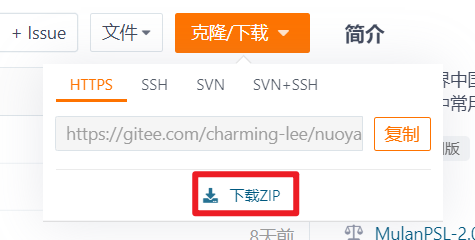

<h1 align="center" style="line-height: 0;">「nuoyanlib」</h1>
<h1 align="center" style="line-height: 0;">🐱</h1>
<h1 align="center" style="line-height: 0;">ModSDK开发工具</h1>
<h2 align="center" style="line-height: 0.5;">v0.1.0-beta</h2>

<br></br>

<br></br>

## 💼 介绍

---

> **[注意]**  
目前该项目仍处于测试阶段，部分功能仍未开发完成或存在较多bug，且其中的函数名称、功能等随时可能会发生变化。

「nuoyanlib」是基于我的世界中国版ModSDK开发的开源函数库，整合了众多开发中常用的算法，封装了部分常用的官方接口。  
「nuoyanlib」目前仅由 _**诺言Nuoyan**_ 一人开发，所有代码均为原创。  
「nuoyanlib」可供大家学习参考，也可以直接应用于您个人/团队的项目中，希望「nuoyanlib」能提高大家的代码编写效率以及更轻松地实现复杂的效果！  
感谢大家支持作者、支持该项目，喜欢的话可以点个Star噢，您的支持是作者最大的动力！  

**_兼容的ModSDK版本：2.8_**

<br></br>

## ⬇️ 下载

---

- 下载项目完整文件：点击页面上方“克隆/下载”按钮，下载ZIP。

<p align="center">
  
</p>

- 下载「nuoyanlib」：在右侧发行版处选择一个版本下载。

<p align="center">
  
</p>

<br></br>

## ✨ 功能一览

---

- [**client（客户端函数库）**](/nuoyanlib/client)  

  > 包含clientcomp、clientTimer、effector、nuoyanClientSystem、player、setting、sound模块。

  提供了客户端扩展等实用功能。


- [**client.ui（UI库）**](/nuoyanlib/client/ui)  

  > 包含itemFlyAnim、itemGridManager、itemTipsBox、nuoyanScreenNode、utils模块。

  提供了ScreenNode扩展、物品网格管理器等实用工具。


- [**server（服务端函数库）**](/nuoyanlib/server)  

  > 包含entity、globalPlayerManager、hurt、inv、nuoyanServerSystem、servercomp、serverTimer、structure模块。

  涵盖了服务端扩展、实体获取、实体操作、范围伤害、背包管理等各种功能。


- [**utils（通用工具库）**](/nuoyanlib/utils)  

  > 包含calculator、enum、error、item、mcRandom、utils、vector模块。

  提供了多种数学计算函数、更多的枚举值等实用工具。

<br></br>

## ⚙️ 使用说明

---

1. 解压下载的文件，将`nuoyanlib`文件夹放至您的行为包根目录下（即`entities`文件夹所在目录）。
2. 打开`nuoyanlib/config.py`配置文件，将您的模组名称、客户端系统名称和服务端系统名称填入对应位置。 
    > **[注意]**  
    请确保填入`config.py`的信息与您的模组对应，否则部分功能将无法使用。
    
    ```python
    # 在modMain注册时填写的模组名称（命名空间）
    MOD_NAME = "MyMod"
    # 客户端系统名称
    CLIENT_SYSTEM_NAME = "MyClientSystem"
    # 服务端系统名称
    SERVER_SYSTEM_NAME = "MyServerSystem"
    ```
3. 随后在您的Python文件顶部导入「nuoyanlib」即可：
    ```python
    import nuoyanlib as nyl
    ```

<br></br>

## 🔍 参考文档

---

详见：https://gitee.com/charming-lee/nuoyanlib/tree/master/%E5%8F%82%E8%80%83%E6%96%87%E6%A1%A3

<br></br>

## 🎉 更新信息

---

更多信息详见：

<br></br>

## 🌞 未来计划

---

1. 封装常用官方接口；
2. 增加更多实用功能；
3. 重新整理函数文档注释，完成参考文档的编写；
4. 优化代码；
5. 编写demo；
6. ...

<br></br>

## 👑 贡献

---

本项目欢迎各位开发者共同参与开发，如果您有更好的算法或修改建议，可通过Pull Request或Issue的方式提交，成为本项目的贡献者。

[什么是Issue？](https://help.gitee.com/base/issue/intro)

[什么是Pull Request？](https://help.gitee.com/base/pullrequest/intro)

<br></br>

## ⚖️ 版权

---

本项目遵循[MulanPSL-2.0](https://gitee.com/charming-lee/nuoyanLib/blob/master/LICENSE)开源许可协议，您可以将「nuoyanlib」应用于任何商业/非商业项目中，允许修改其中的内容，但必须保留「nuoyanlib」中每个文件头部的版权注释。

<br></br>

## 👴 联系作者

---

如果在使用过程中遇到问题，可通过以下方式联系作者：
- QQ：1279735247
- 邮箱：1279735247@qq.com

<br></br>