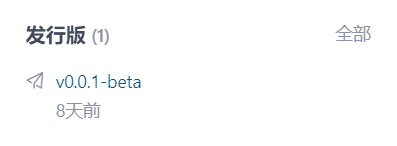

<h1 align="center" style="line-height: 0;">「nuoyanlib」</h1>
<h1 align="center" style="line-height: 0;">🐱</h1>
<h1 align="center" style="line-height: 0;">基于ModSDK的开发工具库</h1>
<h2 align="center" style="line-height: 0.5;">v0.6.0-beta</h2>

<br></br>

<br></br>

## 💼 介绍

---

> **[注意]**  
目前该项目仍处于测试阶段，部分功能仍未开发完成或存在较多bug，且其中的函数名称、功能等随时可能会发生变化，请开发者谨慎使用。

「nuoyanlib」是基于我的世界中国版ModSDK开发的开源函数库，整合了众多开发中常用的算法，封装了部分常用的官方接口。  
「nuoyanlib」目前仅由 _**诺言Nuoyan**_ 一人开发，所有代码均为原创（有备注的除外）。  
「nuoyanlib」可供大家学习参考，也可以直接应用于您个人/团队的项目中，希望「nuoyanlib」能提高大家的代码编写效率以及更轻松地实现复杂的效果！  
感谢大家支持作者、支持该项目，喜欢的话可以点个Star噢，您的支持是作者最大的动力！  

### **兼容框架：ModSDK 3.2、Apollo 1.0（正在开发）**

<br></br>

## ⬇️ 下载

---

在右侧的发行版处选择一个版本下载。

<p align="center">
  
</p>

<br></br>

## ✨ 功能一览

---

- [**client（客户端库）**](/nuoyanlib/client)  
  提供了客户端扩展、特效管理器等客户端专用工具。  


- [**client.ui（UI库）**](/nuoyanlib/client/ui)  
  提供了ScreenNode扩展、物品网格管理器等UI专用工具。


- [**server（服务端库）**](/nuoyanlib/server)  
  提供了服务端扩展、实体获取、实体操作、范围伤害、背包管理等服务端专用工具。


- [**utils（通用工具库）**](/nuoyanlib/utils)  
  提供了多种数学计算函数、更多的枚举值等双端通用的工具。

<br></br>

## ⚙️ 使用说明

---

1. 解压下载的压缩包，将`nuoyanlib`文件夹放至您的脚本根目录下（即`modMain.py`所在目录）即可。
2. 推荐使用以下方式在您的代码中导入「nuoyanlib」，`myScripts`为您的脚本文件夹名称：

    - 导入客户端库
    ```python
    import myScripts.nuoyanlib.client as nyl
    ```
    - 导入UI库
    ```python
    import myScripts.nuoyanlib.client.ui as nylui
    ```
    - 导入服务端库
    ```python
    import myScripts.nuoyanlib.server as nyl
    ```
    > **[警告]**  
    禁止导入对立端的库，如在客户端导入服务端库，服务端导入客户端库，否则可能会导致整个库功能瘫痪甚至游戏闪退等严重问题。

<br></br>

## 🔍 参考文档

---

作者正在熬夜编写中......

<br></br>

## 🎉 更新信息

---

作者正在熬夜编写中......

<br></br>

## 🌞 未来计划TODO

---

1. 重新整理函数文档注释，完成参考文档的编写；
2. 封装更多常用官方接口；
3. 增加更多实用功能；
4. 编写demo；
5. 优化代码；
6. ...

<br></br>

## 👑 贡献

---

本项目欢迎各位开发者共同参与开发，如果您有更好的算法或修改建议，可通过Issue或Pull Request的方式提交，成为本项目的贡献者。

[什么是Issue？](https://help.gitee.com/base/issue/intro)
[什么是Pull Request？](https://help.gitee.com/base/pullrequest/intro)

<br></br>

## ⚖️ 版权

---

本项目遵循[MulanPSL-2.0](https://gitee.com/charming-lee/nuoyanLib/blob/master/LICENSE)开源许可协议，您可以将「nuoyanlib」应用于任何商业/非商业项目中，允许修改其中的内容，但必须保留「nuoyanlib」中每个文件头部的版权注释。

<br></br>

## 👴 联系作者

---

如果在使用过程中遇到问题，可通过以下方式联系作者：

- QQ：1279735247
- 邮箱：1279735247@qq.com

<br></br>