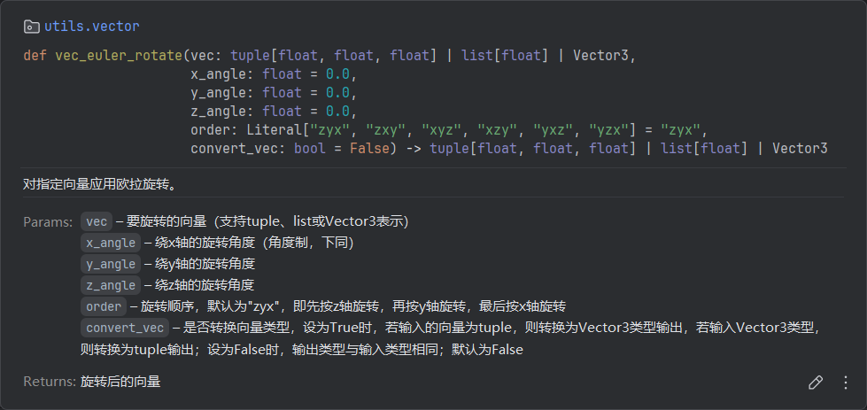
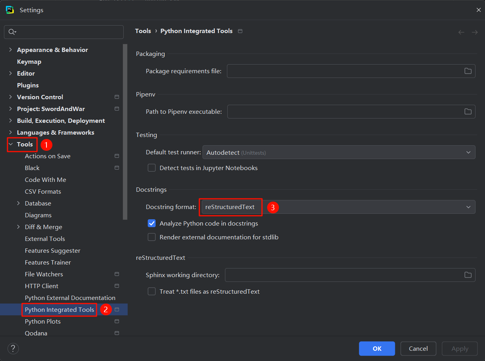
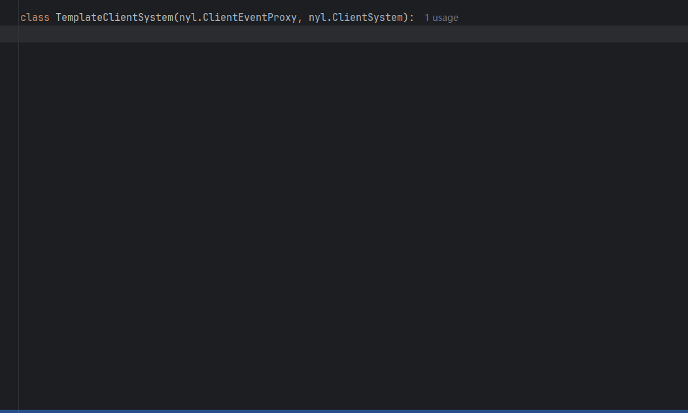

# 「nuoyanlib」入门指南

<br></br>

## 开始

---

### 安装「nuoyanlib」文件

下载并解压压缩包，将`nuoyanlib`文件夹放至行为包Python脚本根目录下（即`modMain.py`文件所在位置）。  
安装好后，您的行为包结构应为： 

```
行为包/  
├── entities/  
├── 脚本根目录/  
│   ├── nuoyanlib/  
│   │   ├── _core/  
│   │   ├── client/  
│   │   ├── server/  
│   │   ├── utils/  
│   │   ├── __init__.py  
│   │   ├── config.py  
│   │   └── LICENSE  
│   ├── __init__.py  
│   ├── modMain.py  
│   ...  
...
```

### 启动「nuoyanlib」

在`modMain.py`中添加以下代码以启动「nuoyanlib」：

```python
import nuoyanlib
nuoyanlib.run(globals())
```

例如：

```python
from mod.common.mod import Mod
import mod.client.extraClientApi as client_api
import mod.server.extraServerApi as server_api


import nuoyanlib
nuoyanlib.run(globals())


@Mod.Binding(name="MyMod", version="1.0.0")
class ModMain(object):
    @Mod.InitServer()
    def init_server(self):
        server_api.RegisterSystem("MyMod", "MyServerSystem", "myScripts.myServerSystem.MyServerSystem")

    @Mod.InitClient()
    def init_client(self):
        client_api.RegisterSystem("MyMod", "MyClientSystem", "myScripts.myClientSystem.MyClientSystem")
```

### 导入「nuoyanlib」

> **[警告]**  
为确保环境安全，请勿将客户端和服务端代码写在同一个py文件内，且禁止导入对立端库（如在客户端导入服务端库，在服务端导入客户端库），否则可能导致「nuoyanlib」功能异常甚至游戏闪退。

在需要时导入「nuoyanlib」，推荐使用以下方式进行导入，其中`<scripts_root>`是Python脚本根目录名称，`<client/server>`表示根据所处环境填写`client`或`server`：

```python
import <scripts_root>.nuoyanlib.<client/server> as nyl
```

对于一些较为常用的功能，你可以直接`import`它们的名称，省去每次都附加`nyl.`前缀的麻烦。

```python
from <scripts_root>.nuoyanlib.client import (
    PLAYER_ID,   # 本地玩家实体ID
    CF,          # 组件工厂（CompFactory）
    PlrComp,     # 本地玩家组件工厂
    LvComp,      # 使用Level ID创建的组件工厂
    event,       # 事件监听装饰器
)
```

到这里，你已经学会「nuoyanlib」最基本的食用方法了。以下是一些增强使用体验的可选项。

### 高级类型提示（可选）

依靠`.pyi`文件，「nuoyanlib」的每个接口都提供了详细精确的类型提示，你可以选择安装以下依赖库以正确显示：

```commandline
pip install typing
```

<div style="text-align: center;">
    
</div>

### 更改PyCharm文档注释格式（可选）

如果你的PyCharm显示的文档注释格式出现问题，可以通过以下步骤在PyCharm设置中将文档注释渲染格式更改为reStructuredText。

<div style="text-align: center;">
    
</div>

<br></br>

## 通用API

---

### 组件工厂

调用ModSDK接口前需要先创建组件工厂，然后再用实体ID或Level ID创建组件。若需要对同一个实体创建多个组件，则每次创建都要重复传入实体ID，比较冗余。  
「nuoyanlib」的`CF`类将这一过程提前，仅需传入一次实体ID即可。

```python
import <scripts_root>.nuoyanlib.client as nyl
cf = nyl.CF(entity_id)
cf.Pos.GetFootPos()
cf.ActorMotion.SeMotion((0.1, 0.1))
cf.EngineType.GetEngineType()
```

以上代码等价于：

```python
import mod.client.extraClientApi as client_api
cf = client_api.GetEngineCompFactory()
cf.CreatePos(entity_id).GetFootPos()
cf.CreateActorMotion(entity_id).SeMotion((0.1, 0.1))
cf.CreateEngineType(entity_id).GetEngineType()
```

此外，「nuoyanlib」已经预设了客户端本地玩家和Level ID的组件工厂，无需再创建。

```python
import <scripts_root>.nuoyanlib.client as nyl
nyl.PlrComp  # 客户端本地玩家组件工厂，等价于nyl.CF(nyl.PLAYER_ID)
nyl.LvComp   # 客户端Level ID组件工厂，等价于nyl.CF(nyl.LEVEL_ID)
```
```python
import <scripts_root>.nuoyanlib.server as nyl
nyl.LvComp # 服务端Level ID组件工厂
```

### 事件监听

ModSDK事件系统的一大痛点，就是事件参数不支持IDE补全，每次都需要手动查阅文档，「nuoyanlib」很好地解决了这个问题。下面是使用客户端事件的一个演示。

<div style="text-align: center;">
    
</div>

要实现这一功能，只需将你的客户端类继承`ClientEventProxy`即可。

```python
import <scripts_root>.nuoyanlib.client as nyl

class MyClientSystem(nyl.ClientEventProxy, nyl.ClientSystem) # 继承事件代理类ClientEventProxy与原版ClientSystem类
    def __init__(self, namespace, system_name):
        super(MyClientSystem, self).__init__(namespace, system_name) # 此处建议使用super
        
    def ClientItemTryUseEvent(self, event):
        ...
```

然后，键入任何一个事件的名称，IDE就会自动显示补全列表。  
使用该方法监听的事件的回调参数为一个`EventArgsProxy`对象，支持事件参数补全与修改，同时兼容旧版字典的写法，因此对于旧项目，你无需对旧版的参数获取方式作任何改动。  
实际上，`ClientEventProxy`在任何类中都可以正常使用，并非强制绑定`ClientSystem`。服务端对应的事件代理类为`ServerEventProxy`，用法相同，不再赘述。  
对于自定义事件，「nuoyanlib」提供了装饰器`@event`来简化事件监听的过程，在函数上方添加该装饰器即可完成监听。

```python
import <scripts_root>.nuoyanlib.<client/server> as nyl

# 监听MyCustomEvent事件，事件来源为MyMod:MyServerSystem
@nyl.event("MyCustomEvent", "MyMod", "MyServerSystem")
def EventCallback(args):
    # 处理事件的代码
    ...
    
# 事件名与函数名相同时，可省略第一个参数
@nyl.event(namespace="MyMod", system_name="MyServerSystem")
def MyCustomEvent(args):
    ...
    
# 监听ModSDK事件且事件名与函数名相同时，可省略所有参数
@nyl.event
def UiInitFinished(args):
    ...
```

> **[小贴士]**  
> 使用`@event`装饰器监听的事件支持热更新。

<br></br>

## 客户端API

---

<br></br>

## 服务端API

---

<br></br>
